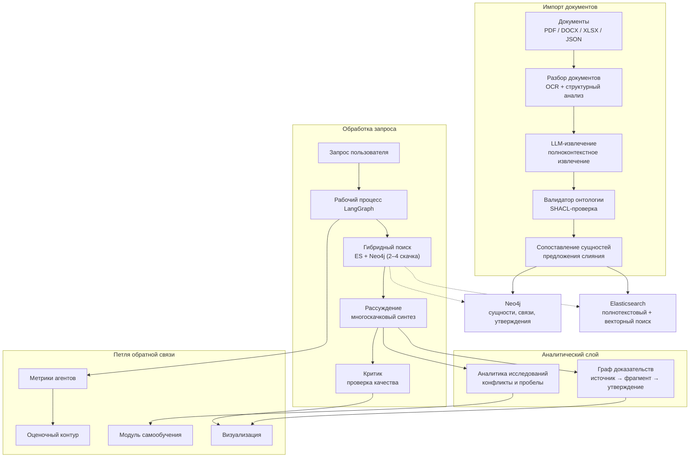
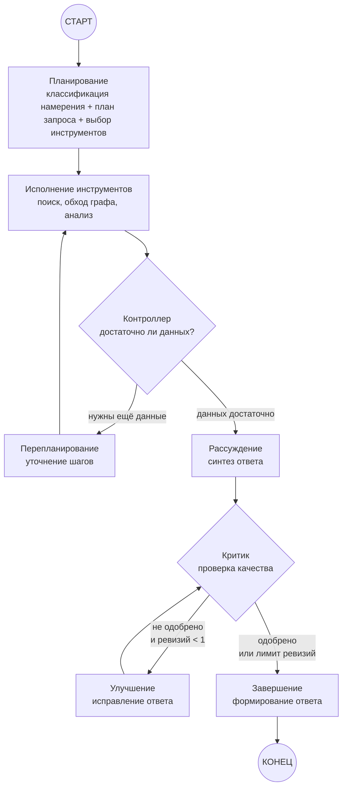
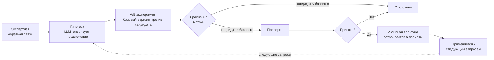

# Научный Клубок

> **Платформа проверяемых R&D-знаний для горно-металлургической отрасли.**

«Научный Клубок» превращает разрозненные научно-технические документы — статьи, доклады, презентации, экспериментальные таблицы — в проверяемую карту знаний. Каждое утверждение в ответе системы имеет происхождение: цепочку от первоисточника через фрагмент текста до конкретного вывода с числовыми условиями. Платформа обнаруживает противоречия, выявляет пробелы в исследованиях и непрерывно совершенствуется за счёт экспертной обратной связи.

| Python 3.12 | FastAPI | LangGraph | Neo4j | Elasticsearch | SvelteKit |
|:---:|:---:|:---:|:---:|:---:|:---:|

---

## Содержание

1. [Проблема и подход](#проблема-и-подход)
2. [Ролевая модель](#ролевая-модель)
3. [Архитектура](#архитектура)
4. [Сильные стороны](#сильные-стороны)
5. [Сравнение с базовым подходом](#сравнение-с-базовым-подходом)
6. [Что реализовано](#что-реализовано)
7. [Что предстоит](#что-предстоит)
8. [Ограничения и открытые задачи](#ограничения-и-открытые-задачи)
9. [Технологический стек](#технологический-стек)
10. [Запуск](#запуск)
11. [Структура проекта](#структура-проекта)
12. [Документация](#документация)

---

## Проблема и подход

### Проблема

Горно-металлургические исследования — это сотни разрозненных источников: журнальные статьи, доклады с конференций, внутренние отчёты, экспериментальные данные. Исследователь вынужден вручную сводить информацию, проверять цифры, находить противоречия и выявлять пробелы. Это дни и недели работы, цена ошибки — миллионы рублей на неверном технологическом решении.

### Почему существующие инструменты недостаточны

| Инструмент | Что не так |
|---|---|
| **Обычный RAG** (поиск по фрагментам) | Теряет происхождение чисел, не понимает структуру эксперимента, не находит противоречия между источниками |
| **Полнотекстовый поиск** | Нет многоскачкового рассуждения, нет сравнения по общим параметрам, нет выявления пробелов |
| **LLM-ассистенты** | Галлюцинации, нет связи с конкретными страницами и ячейками источников, нет доменной онтологии |
| **Экспертные базы данных** | Ручное наполнение, нет автоматического извлечения, нет версионирования фактов |

### Наш подход

«Научный Клубок» строит **граф доказательств** — граф знаний, где каждая сущность, связь и числовое условие привязаны к конкретному фрагменту первоисточника. Система:

- **Извлекает** структурированные данные из документов (PDF/DOCX/XLSX) с помощью LLM, используя полноконтекстное понимание без наивного разбиения на фрагменты.
- **Обнаруживает противоречия** между источниками с указанием конфликтующих условий и доказательств.
- **Выявляет пробелы** — области, где исследования недостаточны или отсутствуют.
- **Учится** на экспертной обратной связи: исправления запускают A/B-эксперименты, лучшие политики встраиваются в промпты.

---

## Доступ и сессия

Вход в платформу — серверная сессия. Account'ы и сессии живут в PostgreSQL (`ACCOUNTS_BACKEND=postgres`), пароли хешируются `hashlib.scrypt` из стандартной библиотеки (параметры зашиты в строку хэша, сравнение постоянное по времени), сессионный токен — opaque, в базе хранится только его SHA-256. Браузер получает cookie `nk_session`: `HttpOnly`, `SameSite=Lax`, `Path=/`, `Max-Age = SESSION_TTL_DAYS` (14 дней по умолчанию), `Secure` только при `APP_ENV=production`. Фронтенд ходит в API через свой же origin (SvelteKit-прокси `/backend`), поэтому cookie приходит и на запрос, и на `Set-Cookie` ответа.

Всё под `/api/v1/` требует действующей сессии, кроме `/api/v1/corpus/stats` и `/api/v1/auth/register|login`. State-changing запрос с cookie дополнительно проверяется по доверенному источнику (`TRUSTED_ORIGINS`, `Origin`/`Referer`) — это компромисс вместо CSRF-токена, подробно в `docs/security-auth.md`. Неудачные входы и смены пароля троттлятся (`LOGIN_MAX_ATTEMPTS` в окне `LOGIN_WINDOW_SECONDS`, ответ `429` с `Retry-After`).

### Права: ролей больше нет

Пяти-ролевой модели (`researcher` / `analyst` / `project_manager` / `administrator` / `external_partner`) и заголовков `X-User-Role` / `X-User-Id` в продукте нет: личность приходит только с сервера. Доступ — два уровня:

| Уровень | Кто | Разрешения | Классы данных |
|---|---|---|---|
| Базовый | любой подтверждённый аккаунт | `knowledge:read`, `query:ask`, `feedback:give`, `export:run`, `evaluation:view` | `public`, `internal` |
| Экспертный | аккаунт с `review_enabled = true` | всё выше + `proposal:review`, `audit:read`, `restricted:read` | + `restricted` |

Экспертный признак не выбирается при регистрации — его выдаёт администратор SQL-запросом (`UPDATE nk_users SET review_enabled = true WHERE email = '…'`). Набор прав и открытых классов возвращает `GET /api/v1/auth/me`; фронтенд ничего не домысливает и не хранит роль в `localStorage`.

### Классы данных

Утверждения делятся на три класса в зависимости от статуса:

| Статус утверждения | Класс данных | Кто видит |
|---|---|---|
| `consensus` (подтверждено) | Публичный | Все подтверждённые аккаунты |
| `hypothesis` (гипотеза) | Внутренний | Все подтверждённые аккаунты |
| `disputed` (оспорено) | Закрытый | Аккаунты с экспертным признаком |

Фильтрация применяется дважды: **до поиска** (ограничение доступных классов на уровне рабочего процесса) и **после поиска** (дополнительная фильтрация результатов в API-ответе).

---

## Архитектура

### Системная архитектура



### Рабочий процесс агента (LangGraph)



### Петля самообучения



---

## Сильные стороны

- **Ответы с доказательной базой** — каждый тезис трассируется до конкретной страницы источника или ячейки таблицы.
- **Числовые данные с единицами измерения** — извлечение чисел с нормализацией единиц, поддержкой диапазонов и условий.
- **Обнаружение противоречий** — система находит конфликтующие утверждения между источниками.
- **Выявление пробелов** — определяет области, где исследования недостаточны или отсутствуют.
- **Гибридный поиск** — полнотекстовый + векторный поиск + обход графа (2–4 скачка) с слиянием ранжирования.
- **Самообучение** — экспертная обратная связь инициирует A/B-эксперимент; если кандидат не хуже базового — политика принимается.
- **Оценочный контур** — измеримое преимущество над лексическим базовым подходом по метрикам покрытия цитирования, числовой поддержки и точности доказательств.
- **Серверная сессия и два уровня доступа** — базовый и экспертный, с фильтрацией данных и журналом аудита.
- **Мультиформатный импорт** — PDF (включая OCR), DOCX, XLSX, JSON, TXT.
- **Полное происхождение** — от первоисточника через фрагмент текста до конкретного утверждения и финального ответа.

---

## Сравнение с базовым подходом

### Обычный RAG против «Научного Клубка»

| Характеристика | Обычный RAG | Научный Клубок |
|---|---|---|
| **Происхождение** | Уровень фрагмента (неточно) | Точное: страница / ячейка / локатор |
| **Числовые данные** | Текст без нормализации | Числа + единицы + диапазоны + условия |
| **Противоречия** | Не обнаруживает | Обнаружение конфликтов с условиями и доказательствами |
| **Пробелы** | Не выявляет | Выявление пробелов по измерениям и сущностям |
| **Многоскачковый анализ** | Ограничен 1 скачком | 2–4 скачка по графу сущностей |
| **Сравнения** | Нет | Сравнительные запросы по общим измерениям |
| **Обучение** | Статичный | Самообучение через экспертную обратную связь |

### Метрики оценки

| Метрика | Описание |
|---|---|
| `citation_coverage` | Доля тезисов в ответе, имеющих ссылку на источник |
| `numeric_support` | Доля числовых утверждений, подтверждённых доказательствами |
| `unsupported_claim_ratio` | Доля находок, где числа тезиса не подтверждены цитатой |
| `mean_finding_confidence` | Средняя уверенность находок в ответе |
| `recall@3` | Доля ожидаемых источников, найденных среди трёх лучших (не «найден ли хоть один»; в отчёте считается также для 5 и 10) |
| `hit@3` | Случайно ли хоть одно ожидание попал в топ-k; справочная метрика, порога не имеет (в отчёте — для 3 и 10) |
| `precision@3` | Доля релевантных находок среди трёх лучших (в отчёте также для 5) |
| `MRR` | Средняя обратная ранговая позиция |
| `NDCG@3` | Нормализованный дисконтированный совокупный выигрыш при k=3 (идеал — по ожидаемым источникам) |

---

## Что реализовано

### Серверная часть

- ✅ Импорт документов на русском и английском (PDF / DOCX / XLSX / JSON / TXT)
- ✅ OCR и структурный разбор с локаторами (страница, ячейка, координаты)
- ✅ Извлечение сущностей и связей с доказательными ссылками
- ✅ Извлечение числовых данных с нормализацией единиц
- ✅ Сопоставление сущностей с предложениями слияния
- ✅ Доменная онтология (SHACL-ограничения)
- ✅ Обходы графа (2–4 скачка)
- ✅ Версионирование фактов с цепочкой SUPERSEDES (после перезапуска истории
  восстанавливаются по связям `superseded_by`, а не только из памяти процесса)
- ✅ GigaChat как единственный LLM-провайдер: структурированный вывод и
  эмбеддинги `/embeddings`
- ✅ Бюджет агентного запроса: при исчерпании — неполный ответ с
  `degradation_reasons`
- ✅ Естественно-языковой поиск с типизированным планом запроса
- ✅ Многомерные фильтры (домен, тип, год, география)
- ✅ Числовые фильтры со сравнением единиц
- ✅ Сравнительные запросы по общим измерениям
- ✅ Визуализация графа доказательств
- ✅ Подсветка конфликтов с условиями
- ✅ Выявление пробелов в покрытии знаний
- ✅ Поиск экспертов и лабораторий
- ✅ Структурированная проверка (согласие / несогласие с условиями)
- ✅ Консенсус и разногласия между источниками
- ✅ Рекомендации как гипотезы
- ✅ Серверная сессия (httpOnly cookie) и два уровня прав вместо пяти ролей
- ✅ Журнал аудита всех действий
- ✅ Граф-корректировка экспертами
- ✅ Экспорт (Markdown + JSON-LD + PDF)
- ✅ Панель состояния (дашборд покрытия и активности собственного аккаунта)
- ✅ Сравнительное технологическое рабочее пространство
- ✅ Обратная связь и самообучение

### Клиентская часть

- ✅ Рабочие разделы отдельными маршрутами под сессией: запрос, карта связей,
  находки, противоречия, сравнение, обратная связь, панель и аккаунт
- ✅ Фильтрация интерфейса по разрешениям из `GET /api/v1/auth/me`
- ✅ Интерактивная визуализация графа (масштабирование, расширение соседей, подсветка путей, фильтр по типам)
- ✅ Панель оценки с бенчмарк-сравнением
- ✅ Сравнительная таблица с ячейками, подкреплёнными доказательствами
- ✅ Дашборд со статистикой покрытия и активностью
- ✅ Отображение плана запроса с распознанными сущностями и фильтрами
- ✅ Метрическая панель (покрытие цитирования, числовая поддержка тезисов,
  доля тезисов без поддержки чисел)
- ✅ Индикатор режима LLM в ответе и в статусе сервиса (`gigachat`,
  `scripted`, `unavailable`)
- ✅ Состояния загрузки / пустого контента / ошибки / ограничения доступа

---

## Что предстоит

| Что | Приоритет | Описание |
|---|---|---|
| Объектные права на уровне проекта и документа | Блокер для чувствительных данных | Сессия и два уровня прав есть; не хватает ACL на конкретный документ/проект, восстановления пароля и внешнего SSO |
| Серверное состояние аудита и экспертных решений | — | Журнал аудита, экспертные решения, серверные копии ответов, предложения эволюции, A/B-эксперименты, прогоны оценки и лента уведомлений живут в PostgreSQL (`services/durable_state.py`); при недоступной базе контур деградирует в память процесса, и `/health/ready` отдаёт `services.server_state: "fallback"` |
| Миграции и резервные копии данных | Блокер | Нет инструмента изменения схемы графа и индексов, бэкапа томов и проверки восстановления |
| Асинхронные вызовы Neo4j и Elasticsearch | Высокий | Драйверы синхронные; обращения вынесены из event loop в `asyncio.to_thread`, но потоки пула всё равно заняты ожиданием сети — асинхронные клиенты убрали бы эту цену |
| Промышленный контур развёртывания | Высокий | Оркестрация, ingress и TLS, внешнее хранение и ротация секретов |
| Отложенный импорт и повторные прогоны | Высокий | Очередь и retry-контур для массового импорта корпуса и долгих запросов |
| Нагрузочное тестирование | Средний | Проверка на масштабе порядка 1 млн сущностей и конкурентных запросов аналитиков |
| Расширение предметной области | Средний | Онтология, единицы измерения и эталонные случаи для второго корпуса |
| Улучшенная раскладка графа | Средний | Силовая раскладка с семантическим масштабированием |

Реализовано ранее и доступно в коде: до-поисковая и пост-поисковая фильтрация по
классам данных, PostgreSQL-чекпоинтер LangGraph (`AsyncPostgresSaver` в
neo4j-режиме), потоковая отдача хода запроса `/api/v1/query/stream`, лента
событий разбора в API (`/api/v1/notifications`, серверное состояние; доставки нет
никуда — ни push, ни подписок на темы, в интерфейсе лента не показывается).

---

## Ограничения и открытые задачи

- **Зависимость от LLM** — требуется API-ключ GigaChat (`GIGACHAT_API_KEY`); других LLM-провайдеров и резервной модели в контуре нет. Без ключа сервис запускается, но проверка готовности возвращает `degraded` с `model_mode: "unavailable"`, а зависимые от LLM эндпоинты — `503`.
- **Бюджет одного запроса** — прогон ограничен `AGENT_DEADLINE_SECONDS` (общий дедлайн), `AGENT_MAX_TOOL_ROUNDS` (перепланирования), `AGENT_MAX_REVISIONS` (циклы Critic → Improver) и `CONTEXT_TOKEN_BUDGET` (доказательственный контекст агентов). При упоре в лимит возвращается неполный ответ с причиной в `degradation_reasons`, а не урезанный молча.
- **Эфемерное состояние** — `memory`-адаптер базы знаний существует для тестов и локального запуска; рабочий контур аналитиков — Neo4j + Elasticsearch + PostgreSQL-чекпоинтер. Журналы и серверные копии ответов (аудит, экспертные решения, ответы для экспорта, предложения эволюции, A/B-эксперименты, прогоны оценки, лента уведомлений) живут в `services/durable_state.py` с веткой PostgreSQL, и активная политика промпта поднимается из серверного состояния при старте; при недоступной базе всё это деградирует в память процесса с ограниченным буфером, и `/health/ready` показывает `services.server_state: "fallback"`.
- **Один корпус** — извлечение, онтология, справочники единиц и эталонные случаи настроены под горно-металлургический корпус; подключение новой предметной области требует их перенастройки, а не только загрузки файлов.
- **Синхронные инфраструктурные драйверы** — обращения к Neo4j и Elasticsearch идут через синхронные клиенты; на путях запроса они обёрнуты в `asyncio.to_thread` и не блокируют event loop, но занимают потоки пула. Асинхронные драйверы сняли бы это ограничение параллельности.
- **Объектные права не доведены** — доступ проверяется по классу данных и разрешениям сессии, но права на конкретный документ или проект (granular ACL) не назначаются; восстановление пароля и внешний SSO не реализованы, экспертный признак выдаёт администратор SQL'ем.
- **Контур развёртывания** — сборка и запуск на Docker Compose, публикация с версионированными образами; промышленного контура (оркестрация, managed-ingress, внешнее хранение секретов, резервное копирование томов) пока нет.

---

## Технологический стек

| Технология | Версия | Роль в системе |
|---|---|---|
| **Python** | 3.12 | Основной язык серверной части |
| **FastAPI** | 0.115+ | REST API, OpenAPI-документация |
| **LangGraph** | 0.2+ | Рабочий процесс агентов, конечный автомат |
| **Neo4j** | 5.x | Графовая БД: сущности, связи, утверждения |
| **Elasticsearch** | 8.x | Полнотекстовый + векторный поиск |
| **SvelteKit** | 2.x / Svelte 5 | Клиентское SPA-приложение |
| **Tailwind CSS** | 4.x | Стилизация клиентской части |
| **Docker / Compose** | — | Контейнеризация и оркестрация |
| **PostgreSQL** | 17.x | Долговременное хранение (чекпоинтер) |
| **Redis** | 7.x | Кэширование |
| **MinIO** | — | Объектное хранилище документов |
| **GigaChat** | — | Единственный LLM-провайдер: чат и эмбеддинги |
| **Tesseract OCR** | 5.x | OCR для сканированных PDF |
| **Pydantic** | 2.x | Валидация моделей и контрактов |
| **pytest** | 8.x | Тестирование |
| **Ruff** | 0.6+ | Линтер и форматтер |
| **mypy** | 1.11+ | Статическая типизация |
| **Grafana** | 12.x | Мониторинг и дашборды |
| **Prometheus** | 3.x | Сбор метрик |

---

## Запуск

### Быстрый старт (Docker Compose)

**Шаг 1. Настройка окружения**

```bash
cp .env.example .env
```

Отредактируйте `.env`:
- `GIGACHAT_API_KEY` — ключ GigaChat, единственного LLM-провайдера платформы; без него LLM-эндпоинты отдают `503`
- `GIGACHAT_MODEL=GigaChat`, `GIGACHAT_EMBEDDINGS_MODEL=Embeddings`, `GIGACHAT_SCOPE=GIGACHAT_API_PERS` — модель, модель эмбеддингов и область API (`GIGACHAT_API_PERS` / `GIGACHAT_API_B2B` / `GIGACHAT_API_CORP`)
- `GIGACHAT_MAX_CONCURRENT=1`, `GIGACHAT_MAX_RETRIES=3` — одновременность индивидуального тарифа и транспортные повторы SDK
- `GIGACHAT_TRUSTED_ROOTS=certs/russian-trusted-root-ca.crt` — дополнительный доверенный корень TLS: GigaChat обслуживается цепочкой Российского УЦ (Минцифры), которого нет в certifi, поэтому без него верификация TLS отбивает авторизацию. Файл публичный, верификацию не ослабляет
- `EMBEDDING_DIMENSIONS=1024` — размерность эмбеддингов GigaChat `/embeddings`
- `AGENT_DEADLINE_SECONDS=300`, `AGENT_MAX_TOOL_ROUNDS=2`, `AGENT_MAX_REVISIONS=1`, `CONTEXT_TOKEN_BUDGET=24000` — бюджет одного агентного запроса
- `CORS_ORIGINS=http://localhost:5173,http://localhost:43119` — разрешённые источники (должны включать порт фронтенда)
- Порты сервисов: `BACKEND_PORT=46617`, `FRONTEND_PORT=43119`, `GRAFANA_PORT=45213`, `PROMETHEUS_PORT=46307`

**Шаг 2. Запуск инфраструктуры и сервисов**

```bash
docker compose up -d --build --wait
```

Порядок запуска (автоматический через `depends_on`):
1. Инфраструктура: Neo4j, Elasticsearch, Redis, PostgreSQL, MinIO
2. Backend (после готовности инфраструктуры)
3. Frontend + Prometheus (после готовности backend)
4. Grafana (после готовности Prometheus)

Проверка: `docker compose ps` — все сервисы должны быть `healthy`.

**Шаг 3. Предзагрузка корпуса документов**

```bash
docker compose --profile tools run --rm preload
```

Этот шаг загружает документы из папки `Источники информации/` в граф знаний (Neo4j) и поисковый индекс (Elasticsearch):
- **Структурная индексация**: сканирует до 900 документов (PDF, DOCX, XLSX), извлекает фрагменты текста
- **Семантическая экстракция**: обрабатывает 10 документов из `preload_manifest.json` через LLM (извлечение сущностей, утверждений, числовых условий)
- **Построение графа**: создаёт сущности, отношения и утверждения в Neo4j

Предзагрузка занимает несколько минут (LLM-экстракция). Данные сохраняются в Docker volumes и не теряются при перезапуске контейнеров.

**Шаг 4. Проверка работоспособности**

```bash
# Backend health
curl http://localhost:46617/health/live

# Frontend
open http://localhost:43119

# Benchmark (опционально)
docker exec mindai-scientific-tangle-backend-1 python -m scientific_tangle.evaluation.run_benchmark
```

### Доступные сервисы

Всего 9 контейнеров (порядок запуска определяется `depends_on` в `compose.yaml`):

| Сервис | Порт | Описание |
|---|---|---|
| backend | 46617 | FastAPI + LangGraph backend |
| frontend | 43119 | SvelteKit frontend (на русском) |
| neo4j | 127.0.0.1:47129, 127.0.0.1:44917 | Граф знаний (Neo4j Browser + Bolt) |
| elasticsearch | 127.0.0.1:42733 | Гибридный поиск (BM25 + kNN) |
| postgresql | (internal) | Аккаунты, сессии, серверное состояние, чекпоинты LangGraph |
| redis | (not mapped) | В контуре есть, приложением не вызывается: очередей и кэша нет |
| minio | 127.0.0.1:48417, 127.0.0.1:48909 | Задел под артефакты: код объектное хранилище не использует |
| prometheus | 46307 | Метрики |
| grafana | 45213 | Дашборды |

### Корпус документов

Корпус расположен в папке `Источники информации/` и содержит ~224+ документа на русском языке по теме горно-металлургической промышленности:

```
Источники информации/
├── Доклады/               (16 файлов: PDF, PPTX)
├── Журналы/               (4 журнала: Горная промышленность, Горный журнал, Обогащение руд, Цветные металлы)
├── Материалы конференций/ (40+ файлов: ALTA, Copper, и др.)
├── Обзоры/                (104 файла: DOCX, PDF)
└── Статьи/                (60 файлов: PDF)
```

### Локальная разработка (без Docker)

```bash
# Серверная часть
python -m pip install -e ".[dev]"
python -m uvicorn scientific_tangle.api.app:app --reload --port 46617

# Клиентская часть
cd frontend
npm ci
npm run dev
```

### Проверки

```bash
python -m ruff check .
python -m mypy src
python -m pytest
cd frontend && npm run check && npm run build
docker compose config --quiet
```

> Без `GIGACHAT_API_KEY` проверка готовности возвращает `degraded` с
> `model_mode: "unavailable"`, а зависимые от LLM эндпоинты — `503`.

---

## Структура проекта

```
mindai-labs/
├── src/scientific_tangle/     # Серверная часть → см. src/README.md
├── frontend/                  # Клиентская часть → см. frontend/README.md
├── tests/                     # Тесты → см. tests/README.md
├── screenshots/               # Снимки экрана → см. screenshots/README.md
├── ops/                       # Инфраструктурный мониторинг
│   ├── prometheus/            # Конфигурация Prometheus
│   └── grafana/               # Панели Grafana
├── docs/                      # Проектная документация
├── compose.yaml               # Docker Compose: все сервисы
├── pyproject.toml             # Python-зависимости и конфигурация
└── .env.example               # Шаблон переменных окружения
```

---

## Документация

- [Серверная часть (src/)](src/README.md)
- [Клиентская часть (frontend/)](frontend/README.md)
- [Тесты (tests/)](tests/README.md)
- [Снимки экрана (screenshots/)](screenshots/README.md)
- [Архитектурное решение](docs/architecture.md)
- [Функциональные и нефункциональные требования](docs/requirements.md)
- [Продуктовый дизайн](docs/product-design.md)
- [План реализации](docs/implementation-plan.md)
- [Стратегия запуска](docs/launch-strategy.md) — доказательства, которыми
  продукт подтверждает своё утверждение, и запрещённые формы подачи

## Откат

Приложения разворачиваются с версионированными образами. Для отката вернуть предыдущий тег серверной и клиентской частей и выполнить `docker compose up -d --no-deps backend frontend`; именованные тома не удалять.
