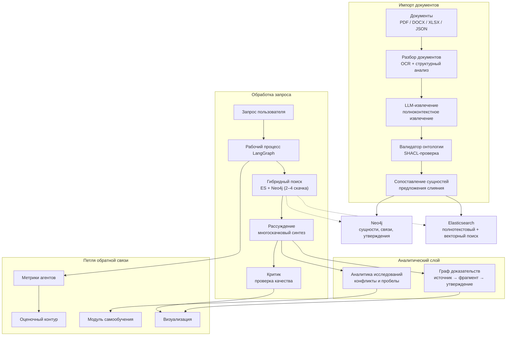
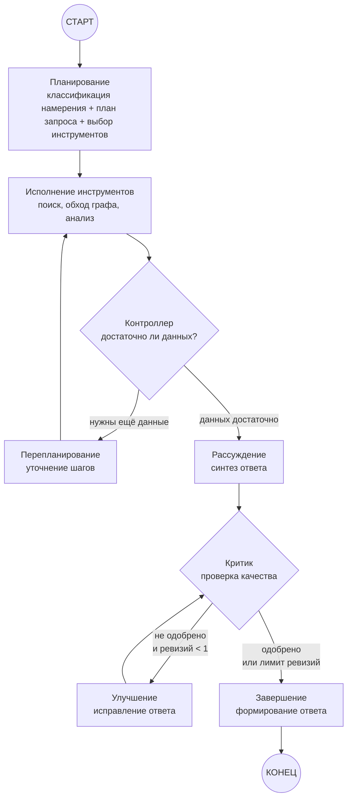
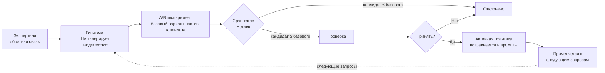

# Научный Клубок

> **Платформа проверяемых R&D-знаний для горно-металлургической отрасли.**

«Научный Клубок» превращает разрозненные научно-технические документы — статьи, доклады, презентации, экспериментальные таблицы — в проверяемую карту знаний. Каждое утверждение в ответе системы имеет происхождение: цепочку от первоисточника через фрагмент текста до конкретного вывода с числовыми условиями. Платформа обнаруживает противоречия, выявляет пробелы в исследованиях и непрерывно совершенствуется за счёт экспертной обратной связи.

| Python 3.12 | FastAPI | LangGraph | Neo4j | Elasticsearch | SvelteKit |
|:---:|:---:|:---:|:---:|:---:|:---:|

---

## Содержание

1. [Проблема и подход](#проблема-и-подход)
2. [Ролевая модель](#ролевая-модель)
3. [Архитектура](#архитектура)
4. [Сильные стороны](#сильные-стороны)
5. [Сравнение с базовым подходом](#сравнение-с-базовым-подходом)
6. [Что реализовано](#что-реализовано)
7. [Что предстоит](#что-предстоит)
8. [Ограничения](#ограничения)
9. [Технологический стек](#технологический-стек)
10. [Запуск](#запуск)
11. [Структура проекта](#структура-проекта)
12. [Документация](#документация)

---

## Проблема и подход

### Проблема

Горно-металлургические исследования — это сотни разрозненных источников: журнальные статьи, доклады с конференций, внутренние отчёты, экспериментальные данные. Исследователь вынужден вручную сводить информацию, проверять цифры, находить противоречия и выявлять пробелы. Это дни и недели работы, цена ошибки — миллионы рублей на неверном технологическом решении.

### Почему существующие инструменты недостаточны

| Инструмент | Что не так |
|---|---|
| **Обычный RAG** (поиск по фрагментам) | Теряет происхождение чисел, не понимает структуру эксперимента, не находит противоречия между источниками |
| **Полнотекстовый поиск** | Нет многоскачкового рассуждения, нет сравнения по общим параметрам, нет выявления пробелов |
| **LLM-ассистенты** | Галлюцинации, нет связи с конкретными страницами и ячейками источников, нет доменной онтологии |
| **Экспертные базы данных** | Ручное наполнение, нет автоматического извлечения, нет версионирования фактов |

### Наш подход

«Научный Клубок» строит **граф доказательств** — граф знаний, где каждая сущность, связь и числовое условие привязаны к конкретному фрагменту первоисточника. Система:

- **Извлекает** структурированные данные из документов (PDF/DOCX/XLSX) с помощью LLM, используя полноконтекстное понимание без наивного разбиения на фрагменты.
- **Обнаруживает противоречия** между источниками с указанием конфликтующих условий и доказательств.
- **Выявляет пробелы** — области, где исследования недостаточны или отсутствуют.
- **Учится** на экспертной обратной связи: исправления запускают A/B-эксперименты, лучшие политики встраиваются в промпты.

---

## Ролевая модель

Платформа поддерживает 5 ролей с разными уровнями доступа к данным и функциям. Переключение ролей в демо-режиме выполняется через заголовки HTTP-запросов (`X-User-Role`, `X-User-Id`); фронтенд хранит выбранную роль в локальном хранилище и передаёт её с каждым запросом.

### Роли и их возможности

| Роль | Доступ к данным | Ключевые возможности |
|---|---|---|
| **Исследователь** | Публичные и внутренние данные | Запросы к базе знаний, обратная связь по утверждениям, просмотр графа |
| **Аналитик** | Публичные и внутренние данные | Всё вышеперечисленное + экспорт результатов, оценка качества, сравнительный анализ, запуск бенчмарков |
| **Руководитель проекта** | Публичные, внутренние и закрытые данные | Всё вышеперечисленное + проверка предложений по слиянию сущностей и эволюционных гипотез, доступ к закрытым утверждениям |
| **Администратор** | Все классы данных | Полный доступ: журнал аудита, управление пользователями, все функции системы |
| **Внешний партнёр** | Только публичные данные | Ограниченные запросы и просмотр графа знаний (только подтверждённые утверждения) |

### Система разрешений

Каждой роли назначены разрешения, которые проверяются на уровне API-эндпоинтов:

| Разрешение | Описание | Минимальная роль |
|---|---|---|
| `knowledge:read` | Чтение графа знаний | Исследователь |
| `query:ask` | Выполнение исследовательских запросов | Исследователь |
| `feedback:give` | Обратная связь по утверждениям | Исследователь |
| `export:run` | Экспорт результатов | Аналитик |
| `evaluation:view` | Просмотр метрик качества и бенчмарков | Аналитик |
| `proposal:review` | Проверка предложений эволюции и слияния | Руководитель проекта |
| `restricted:read` | Доступ к закрытым данным | Руководитель проекта |
| `audit:read` | Просмотр журнала аудита | Администратор |
| `user:manage` | Управление пользователями | Администратор |

### Классы данных

Утверждения делятся на три класса в зависимости от статуса:

| Статус утверждения | Класс данных | Кто видит |
|---|---|---|
| `consensus` (подтверждено) | Публичный | Все роли |
| `hypothesis` (гипотеза) | Внутренний | Исследователь и выше |
| `disputed` (оспорено) | Закрытый | Руководитель проекта и выше |

Фильтрация применяется дважды: **до поиска** (ограничение доступных классов на уровне рабочего процесса) и **после поиска** (дополнительная фильтрация результатов в API-ответе).

---

## Архитектура

### Системная архитектура



### Рабочий процесс агента (LangGraph)



### Петля самообучения



---

## Сильные стороны

- **Ответы с доказательной базой** — каждый тезис трассируется до конкретной страницы источника или ячейки таблицы.
- **Числовые данные с единицами измерения** — извлечение чисел с нормализацией единиц, поддержкой диапазонов и условий.
- **Обнаружение противоречий** — система находит конфликтующие утверждения между источниками.
- **Выявление пробелов** — определяет области, где исследования недостаточны или отсутствуют.
- **Гибридный поиск** — полнотекстовый + векторный поиск + обход графа (2–4 скачка) с слиянием ранжирования.
- **Самообучение** — экспертная обратная связь инициирует A/B-эксперимент; если кандидат не хуже базового — политика принимается.
- **Оценочный контур** — измеримое преимущество над лексическим базовым подходом по метрикам покрытия цитирования, числовой поддержки и точности доказательств.
- **Ролевая модель доступа** — 5 ролей с фильтрацией данных и журналом аудита.
- **Мультиформатный импорт** — PDF (включая OCR), DOCX, XLSX, JSON, TXT.
- **Полное происхождение** — от первоисточника через фрагмент текста до конкретного утверждения и финального ответа.

---

## Сравнение с базовым подходом

### Обычный RAG против «Научного Клубка»

| Характеристика | Обычный RAG | Научный Клубок |
|---|---|---|
| **Происхождение** | Уровень фрагмента (неточно) | Точное: страница / ячейка / локатор |
| **Числовые данные** | Текст без нормализации | Числа + единицы + диапазоны + условия |
| **Противоречия** | Не обнаруживает | Обнаружение конфликтов с условиями и доказательствами |
| **Пробелы** | Не выявляет | Выявление пробелов по измерениям и сущностям |
| **Многоскачковый анализ** | Ограничен 1 скачком | 2–4 скачка по графу сущностей |
| **Сравнения** | Нет | Сравнительные запросы по общим измерениям |
| **Обучение** | Статичный | Самообучение через экспертную обратную связь |

### Метрики оценки

| Метрика | Описание |
|---|---|
| `citation_coverage` | Доля тезисов в ответе, имеющих ссылку на источник |
| `numeric_support` | Доля числовых утверждений, подтверждённых доказательствами |
| `evidence_precision` | Точность ссылок на доказательства (релевантность источника) |
| `recall@3` | Доля релевантных документов в тройке лучших |
| `MRR` | Средняя обратная ранговая позиция |
| `NDCG@3` | Нормализованный дисконтированный совокупный выигрыш при k=3 |

---

## Что реализовано

### Серверная часть

- ✅ Импорт документов на русском и английском (PDF / DOCX / XLSX / JSON / TXT)
- ✅ OCR и структурный разбор с локаторами (страница, ячейка, координаты)
- ✅ Извлечение сущностей и связей с доказательными ссылками
- ✅ Извлечение числовых данных с нормализацией единиц
- ✅ Сопоставление сущностей с предложениями слияния
- ✅ Доменная онтология (SHACL-ограничения)
- ✅ Обходы графа (2–4 скачка)
- ✅ Версионирование фактов с цепочкой SUPERSEDES
- ✅ Естественно-языковой поиск с типизированным планом запроса
- ✅ Многомерные фильтры (домен, тип, год, география)
- ✅ Числовые фильтры со сравнением единиц
- ✅ Сравнительные запросы по общим измерениям
- ✅ Визуализация графа доказательств
- ✅ Подсветка конфликтов с условиями
- ✅ Выявление пробелов в покрытии знаний
- ✅ Поиск экспертов и лабораторий
- ✅ Структурированная проверка (согласие / несогласие с условиями)
- ✅ Консенсус и разногласия между источниками
- ✅ Рекомендации как гипотезы
- ✅ Ролевая модель доступа для 5 ролей
- ✅ Журнал аудита всех действий
- ✅ Граф-корректировка экспертами
- ✅ Экспорт (Markdown + JSON-LD + PDF)
- ✅ Панель руководителя (дашборд покрытия и активности)
- ✅ Сравнительное технологическое рабочее пространство
- ✅ Обратная связь и самообучение

### Клиентская часть

- ✅ 6-вкладочное исследовательское рабочее пространство (Ответ, Доказательства, Граф, Проверка, Импорт, Оценка)
- ✅ Переключатель ролей с фильтрацией интерфейса по разрешениям
- ✅ Интерактивная визуализация графа (масштабирование, расширение соседей, подсветка путей, фильтр по типам)
- ✅ Панель оценки с бенчмарк-сравнением
- ✅ Сравнительная таблица с ячейками, подкреплёнными доказательствами
- ✅ Дашборд со статистикой покрытия и активностью
- ✅ Отображение плана запроса с распознанными сущностями и фильтрами
- ✅ Метрическая панель (покрытие цитирования, числовая поддержка, точность доказательств)
- ✅ GigaChat как резервный LLM-провайдер
- ✅ Состояния загрузки / пустого контента / ошибки / ограничения доступа

---

## Что предстоит

| Что | Статус | Описание |
|---|---|---|
| Предварительная фильтрация доступа | В разработке | Сейчас фильтрация после поиска; до-поисковое ограничение в планах |
| Уведомления в интерфейсе | В планах | Серверный API готов, клиентская панель в разработке |
| Долговременное хранение состояния | В планах | PostgreSQL-чекпоинтер для состояния LangGraph |
| Kubernetes / Helm | В планах | Манифесты K8s и Helm charts |
| Нагрузочное тестирование | В планах | Тестирование при масштабе 1 млн сущностей |
| Улучшенная раскладка графа | В планах | Силовая раскладка с семантическим масштабированием |

---

## Ограничения

- **Зависимость от LLM** — требуется API-ключ Yandex AI Studio **или** GigaChat (резервный провайдер). Без ключа проверка готовности возвращает `degraded`, зависимые от LLM эндпоинты — `503`.
- **Хранение в памяти** — база знаний, предложения эволюции и журнал аудита хранятся в памяти и не сохраняются между перезапусками. Осознанное решение для демо: мгновенный отклик и простое развёртывание.
- **Демо на одном корпусе** — оптимизировано под один горно-металлургический корпус документов.
- **Синхронные инфраструктурные вызовы** — обращения к Neo4j и Elasticsearch в асинхронном контексте (известный технический долг, не влияет на демо).
- **Без аутентификации** — переключение ролей через HTTP-заголовок для демо; промышленная аутентификация не входит в скоуп хакатона.

---

## Технологический стек

| Технология | Версия | Роль в системе |
|---|---|---|
| **Python** | 3.12 | Основной язык серверной части |
| **FastAPI** | 0.115+ | REST API, OpenAPI-документация |
| **LangGraph** | 0.2+ | Рабочий процесс агентов, конечный автомат |
| **Neo4j** | 5.x | Графовая БД: сущности, связи, утверждения |
| **Elasticsearch** | 8.x | Полнотекстовый + векторный поиск |
| **SvelteKit** | 2.x / Svelte 5 | Клиентское SPA-приложение |
| **Tailwind CSS** | 4.x | Стилизация клиентской части |
| **Docker / Compose** | — | Контейнеризация и оркестрация |
| **PostgreSQL** | 17.x | Долговременное хранение (чекпоинтер) |
| **Redis** | 7.x | Кэширование |
| **MinIO** | — | Объектное хранилище документов |
| **Yandex GPT** | — | Основной LLM-провайдер |
| **GigaChat** (GigaChat-Max) | — | Резервный LLM-провайдер |
| **Tesseract OCR** | 5.x | OCR для сканированных PDF |
| **Pydantic** | 2.x | Валидация моделей и контрактов |
| **pytest** | 8.x | Тестирование |
| **Ruff** | 0.6+ | Линтер и форматтер |
| **mypy** | 1.11+ | Статическая типизация |
| **Grafana** | 12.x | Мониторинг и дашборды |
| **Prometheus** | 3.x | Сбор метрик |

---

## Запуск

### Быстрый старт (Docker Compose)

**Шаг 1. Настройка окружения**

```bash
cp .env.example .env
```

Отредактируйте `.env`:
- `YANDEX_API_KEY` и `FOLDER_ID` — ключи Yandex Cloud (основной LLM)
- `GIGACHAT_API_KEY` — ключ GigaChat (fallback LLM)
- `GIGACHAT_MODEL=GigaChat-Max` — модель GigaChat
- `MODEL_MODE=auto` — автоматический переключатель Yandex → GigaChat (или `MODEL_MODE=gigachat` для только GigaChat)
- `CORS_ORIGINS=http://localhost:5173,http://localhost:13000` — разрешённые источники (должны включать порт фронтенда)
- Порты сервисов: `BACKEND_PORT=18000`, `FRONTEND_PORT=13000`, `GRAFANA_PORT=13001`, `PROMETHEUS_PORT=19090`

**Шаг 2. Запуск инфраструктуры и сервисов**

```bash
docker compose up -d --build --wait
```

Порядок запуска (автоматический через `depends_on`):
1. Инфраструктура: Neo4j, Elasticsearch, Redis, PostgreSQL, MinIO
2. Backend (после готовности инфраструктуры)
3. Frontend + Prometheus (после готовности backend)
4. Grafana (после готовности Prometheus)

Проверка: `docker compose ps` — все сервисы должны быть `healthy`.

**Шаг 3. Предзагрузка корпуса документов**

```bash
docker compose --profile tools run --rm preload
```

Этот шаг загружает документы из папки `Источники информации/` в граф знаний (Neo4j) и поисковый индекс (Elasticsearch):
- **Структурная индексация**: сканирует до 900 документов (PDF, DOCX, XLSX), извлекает фрагменты текста
- **Семантическая экстракция**: обрабатывает 10 документов из `preload_manifest.json` через LLM (извлечение сущностей, утверждений, числовых условий)
- **Построение графа**: создаёт сущности, отношения и утверждения в Neo4j

Предзагрузка занимает несколько минут (LLM-экстракция). Данные сохраняются в Docker volumes и не теряются при перезапуске контейнеров.

**Шаг 4. Проверка работоспособности**

```bash
# Backend health
curl http://localhost:18000/health/live

# Frontend
open http://localhost:13000

# Benchmark (опционально)
docker exec mindai-scientific-tangle-backend-1 python -m scientific_tangle.evaluation.run_benchmark
```

### Доступные сервисы

Всего 9 контейнеров (порядок запуска определяется `depends_on` в `compose.yaml`):

| Сервис | Порт | Описание |
|---|---|---|
| backend | 18000 | FastAPI + LangGraph backend |
| frontend | 13000 | SvelteKit frontend (на русском) |
| neo4j | 7474, 7687 | Граф знаний (Neo4j Browser + Bolt) |
| elasticsearch | 9200 | Гибридный поиск (BM25 + kNN) |
| postgresql | (internal) | Чекпоинты LangGraph (PostgreSQL) |
| redis | (internal) | Кэш и очереди |
| minio | 9000, 9001 | Объектное хранилище (API + Console) |
| prometheus | 19090 | Метрики |
| grafana | 13001 | Дашборды |

### Корпус документов

Корпус расположен в папке `Источники информации/` и содержит ~224+ документа на русском языке по теме горно-металлургической промышленности:

```
Источники информации/
├── Доклады/               (16 файлов: PDF, PPTX)
├── Журналы/               (4 журнала: Горная промышленность, Горный журнал, Обогащение руд, Цветные металлы)
├── Материалы конференций/ (40+ файлов: ALTA, Copper, и др.)
├── Обзоры/                (104 файла: DOCX, PDF)
└── Статьи/                (60 файлов: PDF)
```

### Локальная разработка (без Docker)

```bash
# Серверная часть
python -m pip install -e ".[dev]"
python -m uvicorn scientific_tangle.api.app:app --reload --port 18000

# Клиентская часть
cd frontend
npm ci
npm run dev
```

### Проверки

```bash
python -m ruff check .
python -m mypy src
python -m pytest
cd frontend && npm run check && npm run build
docker compose config --quiet
```

> Без API-ключа LLM проверка готовности возвращает `degraded`, а зависимые от LLM эндпоинты — `503`.

---

## Структура проекта

```
hackathon/
├── src/scientific_tangle/     # Серверная части → см. src/README.md
├── frontend/                  # Клиентская часть → см. frontend/README.md
├── tests/                     # Тесты → см. tests/README.md
├── screenshots/               # Снимки экрана → см. screenshots/README.md
├── ops/                       # Инфраструктурный мониторинг
│   ├── prometheus/            # Конфигурация Prometheus
│   └── grafana/               # Панели Grafana
├── docs/                      # Проектная документация
├── compose.yaml               # Docker Compose: все сервисы
├── pyproject.toml             # Python-зависимости и конфигурация
└── .env.example               # Шаблон переменных окружения
```

---

## Документация

- [Серверная часть (src/)](src/README.md)
- [Клиентская часть (frontend/)](frontend/README.md)
- [Тесты (tests/)](tests/README.md)
- [Снимки экрана (screenshots/)](screenshots/README.md)
- [Архитектурное решение](docs/architecture.md)
- [Функциональные и нефункциональные требования](docs/requirements.md)
- [Стратегия MVP](docs/hackathon-strategy.md)
- [План реализации](docs/implementation-plan.md)
- [Исполнимый план MVP](docs/mvp-execution-plan.md)
- [Запуск production-контейнеров](docs/run-production.md)

## Откат

Приложения разворачиваются с версионированными образами. Для отката вернуть предыдущий тег серверной и клиентской частей и выполнить `docker compose up -d --no-deps backend frontend`; именованные тома не удалять.
