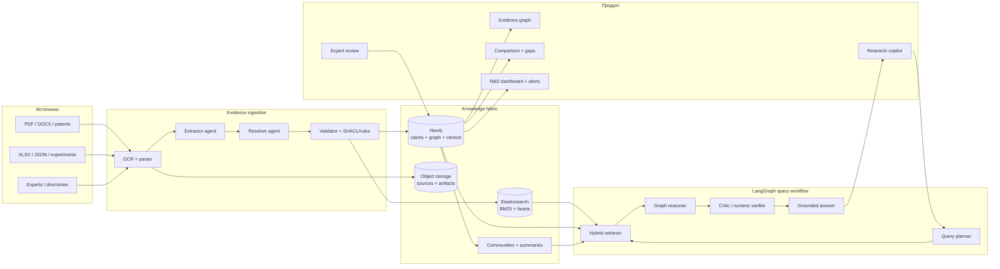

# ADS-001: Hybrid Evidence-Centric Agentic GraphRAG

- Статус: принят (реализовано в текущем коде)
- Дата: 2026-07-02
- Контекст: «Научный Клубок» — исходная архитектура первого этапа. Продукт
  развился в рабочую платформу для аналитиков, поэтому решение остаётся базой,
  а ограничения и следующие шаги перечислены в README (разделы «Ограничения и
  открытые задачи» и «Что предстоит»).

## Решение

Строим evidence-centric Knowledge Graph: граф хранит не только сущности и связи, но и версионируемые утверждения (`Claim`), числовые наблюдения (`Observation`) и точные основания (`Evidence`). Над ним работает hybrid retrieval и ограниченный LangGraph workflow. Это позволяет отвечать на multi-hop запросы, проверять числа, показывать конфликты и отличать факт источника от вывода модели.

## Агенты и реальные обязанности

| Узел | Решение | Детерминированный guardrail |
|---|---|---|
| Extractor | entities, relations, claims, observations | JSON Schema, unit parser, offsets |
| Resolver | canonical entity и merge proposal | словарь aliases, reversible merge |
| Query planner | intent, filters, required evidence | типизированный QueryPlan |
| Retriever | BM25/vector/graph candidate fusion | ACL, limits, allowlisted queries |
| Graph reasoner | multi-hop evidence subgraph | depth/type/path budget |
| Critic | unsupported тезисы, конфликт, полнота | citation и numeric exact checks |
| Improver | feedback → eval case/rule proposal | human approval; no autonomous fact writes |
| Recommender | adjacent cases/experts/gaps | отдельная маркировка hypotheses |

Агенты — наблюдаемые узлы одного state machine, а не автономные чаты. Это снижает latency, стоимость и непредсказуемость, сохраняя наглядность разбора для проверяющего аналитика.

## Онтология

Основные сущности: `Material`, `Process`, `Equipment`, `Experiment`, `Publication`, `Patent`, `Standard`, `Expert`, `Organization`, `Facility`, `Location`, `Property`, `Condition`, `EconomicIndicator`.

Центральные объекты:

- `Claim`: subject, predicate, object/value, polarity, modality, scope, status, version;
- `Observation`: operator, value/min/max, unit, normalized value/unit, uncertainty;
- `Evidence`: document, page/sheet/cell, offsets, quote, extraction metadata;
- `Term`: canonical name, RU/EN aliases, ontology mapping;
- `Review`: decision, actor, reason, timestamp.

Relations включают `USES_MATERIAL`, `USES_EQUIPMENT`, `OPERATES_AT`, `PRODUCES`, `REPORTS`, `SUPPORTED_BY`, `CONTRADICTS`, `VALIDATED_BY`, `SUPERSEDES`, `AUTHORED_BY`, `LOCATED_IN`, `EXPERT_IN`.

## Retrieval

1. Query planner выделяет intent и filters.
2. Elasticsearch даёт lexical candidates/facets, Neo4j vector index — semantic candidates.
3. Reciprocal Rank Fusion объединяет результаты.
4. Параметризованный Cypher расширяет candidates на 2–4 hops.
5. Community summaries дают global context для обзоров.
6. Reranker выбирает evidence subgraph.
7. Reasoner формирует draft, Critic проверяет citations/числа/coverage.

## Противоречия и пробелы

Conflict — не просто semantic dissimilarity. Сравниваются claims с одинаковым subject/predicate и совместимой областью, затем анализируются несовместимые значения/диапазоны с учётом условий. Gap — незаполненная комбинация dimensions в явно заданном исследовательском пространстве; отсутствие ребра само по себе не доказывает научный пробел.

## Self-improvement

Feedback создаёт `EvaluationCase`, обновляет alias/rule proposal и измеряет regression suite. Автономное переобучение и автоматическая публикация фактов исключены из объёма: решение о публикации утверждает эксперт с разрешением `proposal:review`. Цикл замкнут и проверяется на эталонных случаях и A/B-эксперименте, а не только на показе интерфейса.

## Стек

- Python 3.12, FastAPI, Pydantic, LangGraph;
- Neo4j 5.x + GDS/vector index;
- Elasticsearch 8.x, Redis, S3/MinIO;
- Docling/Unstructured + OCR, pandas/openpyxl;
- multilingual embeddings/reranker и provider-agnostic LLM gateway;
- SvelteKit + Svelte 5 для рабочего интерфейса; Cytoscape.js для evidence graph;
- OpenTelemetry, Prometheus, Grafana;
- Docker Compose для локального контура; промышленный контур развёртывания —
  открытая задача.

## Оценка революционности

Компоненты по отдельности не революционны: Knowledge Graph, GraphRAG, agents и human-in-loop известны. Сильная и практически полезная новизна — их предметная композиция вокруг evidence-bearing claims и числовой fidelity. Заявляемое преимущество подтверждается только на сложном вопросе и в сравнении с baseline vector RAG.

## Риски и меры

| Риск | Мера |
|---|---|
| Неверные числа/единицы | deterministic parser + exact eval + source span |
| Entity merge портит граф | proposal/review + reversible merge |
| «Агенты» увеличивают latency | bounded state graph, parallel retrieval, cache |
| Hallucinated Cypher/claims | templates, allowlist, schema validation |
| Красивый граф без пользы | query-scoped evidence graph |
| Обещание 1M/5 sec без доказательств | benchmark profile и честные p95 |
| Слишком широкий showcase | единый seed и один end-to-end narrative |

## Последствия

Архитектура сложнее vector RAG и требует gold set/ontology work. Взамен она напрямую закрывает ключевые требования: multi-parameter traversal, provenance, числовые фильтры, contradictions, gaps, expert review и temporal versions.

